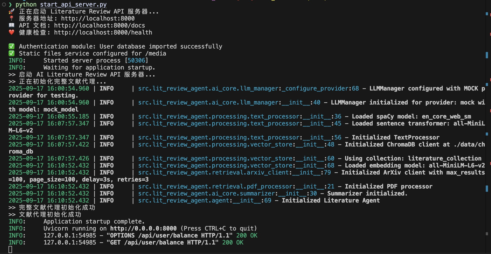
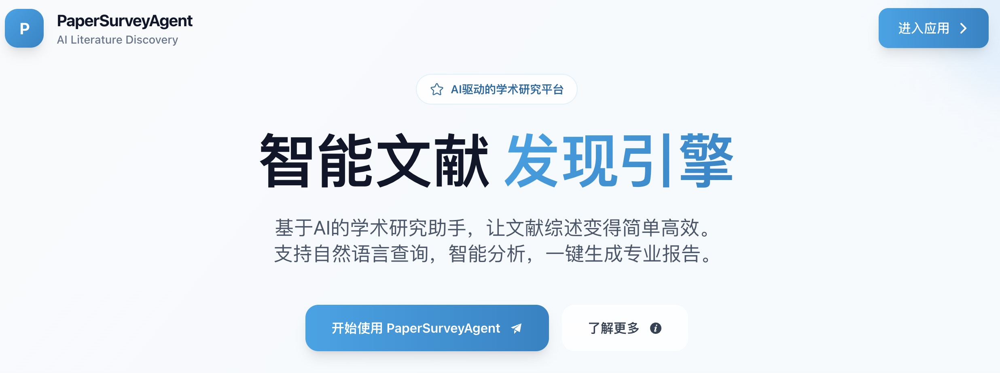
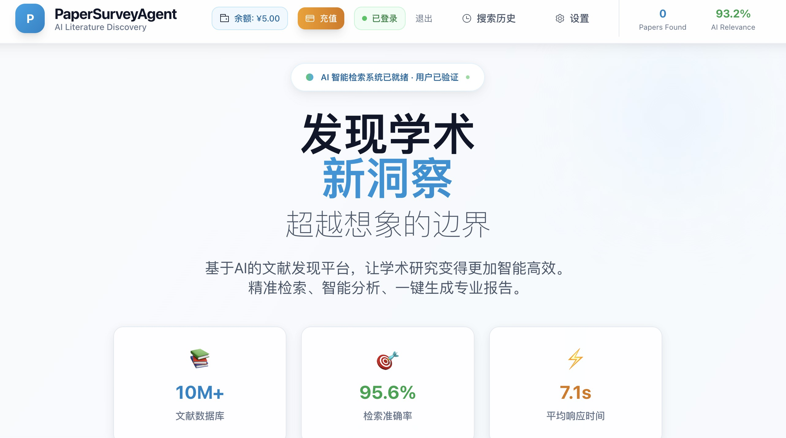

# 🔍 PaperSurveyAgent - AI Literature Discovery Engine

[](https://www.python.org/downloads/)
[](https://vuejs.org/)
[](https://fastapi.tiangolo.com/)
[](LICENSE)
[](https://platform.deepseek.com/)
[](#)

> **AI-powered literature discovery and review generation platform** | **Created by Di**

PaperSurveyAgent is an intelligent literature discovery engine that leverages advanced AI technologies to streamline academic research. It combines natural language processing, vector search, and automated analysis to help researchers find, analyze, and synthesize academic literature efficiently.

## ✨ Key Features

- **🔍 Smart Search**: Natural language queries with intelligent paper discovery using ArXiv integration
- **🤖 AI Analysis**: Automated content analysis and trend identification powered by DeepSeek Reasoner
- **📊 Report Generation**: One-click literature review and summary creation with enhanced abstracts
- **🌐 Multi-Source**: Primary integration with arXiv (Semantic Scholar support planned)
- **⚡ Real-time**: Fast, responsive web interface with live updates
- **🧠 Advanced AI**: DeepSeek Reasoner model with reasoning process logging
- **📈 Vector Search**: ChromaDB-powered semantic search and similarity matching
- **🔄 Robust Processing**: Comprehensive error handling and graceful degradation

## 🚀 Quick Start

### Prerequisites

- Python 3.12+
- Node.js 18+ (for frontend development)
- **DeepSeek API Key** (required) - Get yours at [platform.deepseek.com](https://platform.deepseek.com/)
- OpenAI API Key (optional, for embeddings - system uses sentence-transformers by default)
- Git for version control

### Installation

1. **Clone the repository**

   ```bash
   git clone https://github.com/yourusername/tsearch.git
   cd tsearch
   ```

2. **Set up Python environment**

   ```bash
   # Create virtual environment
   python -m venv venv

   # Activate virtual environment
   source venv/bin/activate

   # Install dependencies
   pip install -e .

   # Install NLP dependencies(spacy)
   python -m spacy download en_core_web_sm
   `spacy.load('en_core_web_sm')`
   ```

3. **Configure API keys**

   ```bash
   # Copy configuration template
   cp config/config.example.env config/config.env

   # Edit config/config.env with your DeepSeek API key
   # DEEPSEEK_API_KEY=sk-your-deepseek-api-key-here
   # DEEPSEEK_MODEL=deepseek-reasoner
   # DEEPSEEK_API_BASE=https://api.deepseek.com/v1

   # Optional: Add OpenAI API key for embeddings
   # OPENAI_API_KEY=sk-your-openai-api-key-here

   # Optional: Add Sementic Scholar API key to increase rate limits
   # https://www.semanticscholar.org/product/api#api-key-form
   # SEMANTIC_SCHOLAR_API_KEY=mock-key-for-testing
   # SEMANTIC_SCHOLAR_TIMEOUT_SECONDS=30
   ```

4. **Start the application**

   ```bash
   # Quick start (recommended)
   python start_api_server.py

   # Alternative: Use scripts
   python scripts/start_backend_only.py  # Backend: http://localhost:8000

   # For frontend development:
   cd frontend/literature-review-frontend
   npm install
   npm run dev  # Frontend: http://localhost:5173
   ```


### Usage

#### Web Interface

1. Open http://localhost:5173 in your browser
2. Enter your research query in natural language
3. Review AI-generated literature analysis
4. Export reports and summaries



#### API Endpoints

- **Health Check**: `GET http://localhost:8000/health`
- **API Documentation**: `GET http://localhost:8000/docs`
- **Quick Search**: `POST http://localhost:8000/api/quick-search`

#### API Examples

**Quick Search**

```bash
curl -X POST "http://localhost:8000/api/quick-search" \
     -H "Content-Type: application/json" \
     -d '{
       "query": "machine learning",
       "maxPapers": 5
     }'
```

**Response Example**

```json
{
  "papers": [
    {
      "title": "Deep Learning for Computer Vision",
      "authors": ["John Doe", "Jane Smith"],
      "abstract": "Enhanced abstract with AI insights...",
      "publication_date": "2023-01-15",
      "source": "arxiv",
      "url": "https://arxiv.org/abs/2301.12345"
    }
  ],
  "total_found": 5,
  "processing_time": 45.2
}
```

## 🏗️ Architecture

```
┌─────────────────┐    ┌─────────────────┐    ┌─────────────────┐
│   Vue3 Frontend │    │  FastAPI Backend│    │   AI Core       │
│                 │    │                 │    │                 │
│ • Search UI     │◄──►│ • REST API      │◄──►│ • DeepSeek LLM  │
│ • Results View  │    │ • Data Validation│    │ • Vector Search │
│ • Report Export │    │ • Error Handling│    │ • Content Analysis│
└─────────────────┘    └─────────────────┘    └─────────────────┘
                                                        │
                                               ┌────────▼────────┐
                                               │  External APIs  │
                                               │                 │
                                               │ • arXiv (Active)│
                                               │ • ChromaDB      │
                                               │ • Sentence      │
                                               │   Transformers  │
                                               └─────────────────┘
```

## 🛠️ Tech Stack

- **Frontend**: Vue 3, TypeScript, Tailwind CSS, Element Plus
- **Backend**: FastAPI, Python 3.12+, Pydantic, Uvicorn
- **AI/ML**: DeepSeek Reasoner API, Sentence Transformers, ChromaDB, spaCy
- **Data Sources**: arXiv API (primary), Semantic Scholar API
- **Processing**: PyPDF2, NLTK, Pandas, NumPy
- **Deployment**: Docker, Docker Compose
- **Development**: pytest, coverage, flake8, mypy

## 📝 API Documentation

Once the backend is running, visit:

- **Interactive API Docs**: http://localhost:8000/docs
- **Health Check**: http://localhost:8000/health

## 🔧 Troubleshooting

### Common Issues

**1. DeepSeek API Key Issues**

```bash
# Check if API key is configured
python -c "from src.lit_review_agent.utils.config import Config; c = Config(); print(f'API Key configured: {bool(c.deepseek_api_key)}')"

# Test API connection
python scripts/test_deepseek_config.py
```

**2. Import Errors**

```bash
# Ensure virtual environment is activated
venv\Scripts\activate  # Windows
source venv/bin/activate  # macOS/Linux

# Reinstall in development mode
pip install -e .
```

**3. Port Already in Use**

```bash
# Check what's using port 8000
netstat -ano | findstr :8000  # Windows
lsof -i :8000  # macOS/Linux

# Use different port
uvicorn src.lit_review_agent.api_server:app --host 0.0.0.0 --port 8001
```

**4. ChromaDB Issues**

```bash
# Clear ChromaDB data
rm -rf data/chroma_db/*

# Restart the application
python start_api_server.py
```

### Performance Tips

- **Memory**: Ensure at least 4GB RAM available for optimal performance
- **Network**: Stable internet connection required for API calls
- **Storage**: Allow 1GB+ for vector database and cache files


## 📄 License

This project is licensed under the MIT License - see the [LICENSE](LICENSE) file for details.


## 🙏 Acknowledgments

- DeepSeek for providing powerful LLM capabilities
- arXiv and Semantic Scholar for academic data access
- The open-source community for excellent tools and libraries
